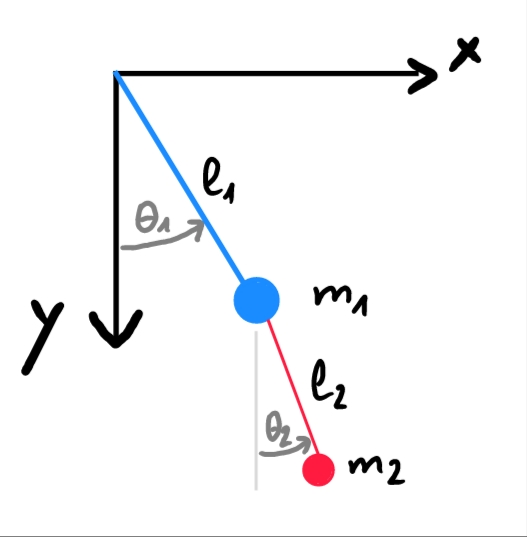
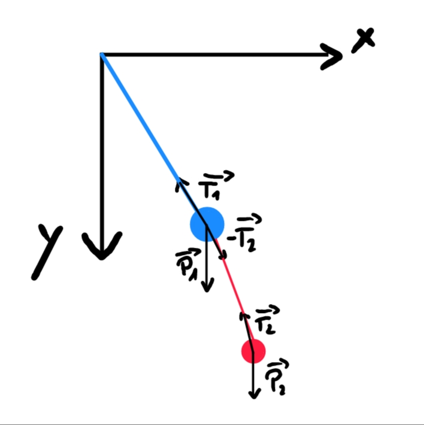

# Double Pendule
Soit un double pendule constitué de deux masses ponctuelles $m_1$ et $m_2$ 
suspendues par des tiges sans masse de longueurs $l_1$ et $l_2$ respectivement. 
Les angles $\theta_1$ et $\theta_2$ sont mesurés par rapport à la verticale.

Position de la masse $m_1$:
$$ \overrightarrow{r_1} =
    \begin{cases}
        x_1 = l_1 \sin(\theta_1) \\
        y_1 = l_1 \cos(\theta_1)
    \end{cases}
$$

Position de la masse $m_2$:
$$ \overrightarrow{r_2} =
    \begin{cases}
        x_2 = x_1 + l_2 \sin(\theta_2) \\
        y_2 = y_1 + l_2 \cos(\theta_2)
    \end{cases}
$$

Vitesse de la masse $m_1$:
$$ \overrightarrow{v_1} =
    \begin{cases}
        v_{1x} = \dot{\theta_1} l_1 \cos(\theta_1) \\
        v_{1y} = -\dot{\theta_1} l_1 \sin(\theta_1)
    \end{cases}
$$

Vitesse de la masse $m_2$:
$$ \overrightarrow{v_2} =
    \begin{cases}
        v_{2x} = v_{1x} + \dot{\theta_2} l_2 \cos(\theta_2) \\
        v_{2y} = v_{1y} - \dot{\theta_2} l_2 \sin(\theta_2)
    \end{cases}
$$

Accélération de la masse $m_1$:
$$ \overrightarrow{a_1} =
    \begin{cases}
        a_{1x} = - l_1 \sin(\theta_1)\dot{\theta_1}^2 + l_1 \cos(\theta_1)\ddot{\theta_1} \\
        a_{1y} = - l_1 \cos(\theta_1)\dot{\theta_1}^2 - l_1 \sin(\theta_1)\ddot{\theta_1}
    \end{cases}
$$

Accélération de la masse $m_2$:
$$ \overrightarrow{a_2} =
    \begin{cases}
        a_{2x} = a_{1x} - l_2 \sin(\theta_2)\dot{\theta_2}^2 + l_2 \cos(\theta_2)\ddot{\theta_2} \\
        a_{2y} = a_{1y} - l_2 \cos(\theta_2)\dot{\theta_2}^2 - l_2 \sin(\theta_2)\ddot{\theta_2}
    \end{cases}
$$

Forces agissant sur la masse $m_1$:
- Tension de la tige supérieure: $\overrightarrow{T_1}$
- Tension de la tige inférieure: $- \overrightarrow{T_2}$
- Poids: $\overrightarrow{P_1} = m_1 \overrightarrow{g}$

Forces agissant sur la masse $m_2$:
- Tension de la tige inférieure: $\overrightarrow{T_2}$
- Poids: $\overrightarrow{P_2} = m_2 \overrightarrow{g}$

Ces forces sont définies comme suit:
$$ \overrightarrow{T_1} = T_1
    \begin{pmatrix}
        \sin(\theta_1) \\
        - \cos(\theta_1)
    \end{pmatrix}
$$
$$ \overrightarrow{T_2} = T_2
    \begin{pmatrix}
        \sin(\theta_2) \\
        - \cos(\theta_2)
    \end{pmatrix}
$$
$$ \overrightarrow{P_1} = m_1 \overrightarrow{g} = m_1 
    \begin{pmatrix} 
        0 \\ 
        g 
    \end{pmatrix}
$$
$$ \overrightarrow{P_2} = m_2 \overrightarrow{g} = m_2 
    \begin{pmatrix} 
        0 \\ 
        g 
    \end{pmatrix}
$$

Selon la deuxième loi de Newton, nous avons:
- Pour la masse $m_1$:
$$ \sum \overrightarrow{F_1} = \overrightarrow{T_1} - \overrightarrow{T_2} + \overrightarrow{P_1} = m_1 \overrightarrow{a_1} $$
$$ m_1 \overrightarrow{a_1} =
    \begin{pmatrix}
        T_1 \sin(\theta_1) - T_2 \sin(\theta_2) \\
        - T_1 \cos(\theta_1) + T_2 \cos(\theta_2) + m_1 g
    \end{pmatrix}
$$
$$
    \begin{cases}
        m_1 a_{1x} = T_1 \sin(\theta_1) - T_2 \sin(\theta_2) \\
        m_1 a_{1y} = - T_1 \cos(\theta_1) + T_2 \cos(\theta_2) + m_1 g
    \end{cases}
$$

- Pour la masse $m_2$:
$$ \sum \overrightarrow{F_2} = \overrightarrow{T_2} + \overrightarrow{P_2} = m_2 \overrightarrow{a_2} $$
$$ m_2 \overrightarrow{a_2} =
    \begin{pmatrix}
        T_2 \sin(\theta_2) \\
        - T_2 \cos(\theta_2) + m_2 g
    \end{pmatrix}
$$
$$
    \begin{cases}
        m_2 a_{2x} = T_2 \sin(\theta_2) \\
        m_2 a_{2y} = - T_2 \cos(\theta_2) + m_2 g
    \end{cases}
$$

Nous voulons, à partir de là, éliminer les tensions $T_1$ et $T_2$.
Pour cela, nous substituons $T_2 sin(\theta_2)$ et $T_2 \cos(\theta_2)$ dans les équations de la masse $m_1$:
$$
    \begin{cases}
        T_2 \sin(\theta_2) = m_2 a_{2x} \\
        T_2 \cos(\theta_2) = m_2 g - m_2 a_{2y}
    \end{cases}
$$
$$
    \begin{cases}
        m_1 a_{1x} = T_1 \sin(\theta_1) - m_2 a_{2x} \\
        m_1 a_{1y} = - T_1 \cos(\theta_1) - m_2 a_{2y} + m_2 g + m_1 g
    \end{cases}
$$

Ensuite, nous isolons $T_1$ dans la première équation et le substituons dans la deuxième:
$$
    \begin{cases}
        T_1 = \frac{m_1 a_{1x} + m_2 a_{2x}}{\sin(\theta_1)} \\
        m_1 a_{1y} = - \frac{m_1 a_{1x} + m_2 a_{2x}}{\sin(\theta_1)} \cos(\theta_1) - m_2 a_{2y} + m_2 g + m_1 g
    \end{cases}
$$

Maintenant, nous séparons les termes en $x$ et $y$:
$$ m_1 a_{1y} = - \frac{m_1 a_{1x} + m_2 a_{2x}}{\sin(\theta_1)} \cos(\theta_1) - m_2 a_{2y} + m_2 g + m_1 g $$
$$ m_1 a_{1y} \sin(\theta_1) = - (m_1 a_{1x} + m_2 a_{2x}) \cos(\theta_1) + \sin(\theta_1) (m_2 g + m_1 g - m_2 a_{2y}) $$
$$ m_1 a_{1y} \sin(\theta_1) + m_2 a_{2y} \sin(\theta_1) = - (m_1 a_{1x} + m_2 a_{2x}) \cos(\theta_1) + \sin(\theta_1) (m_2 g + m_1 g) $$
$$ \sin(\theta_1) (m_1 a_{1y} + m_2 a_{2y} - m_1 g - m_2 g) = - (m_1 a_{1x} + m_2 a_{2x}) \cos(\theta_1) $$

Ensuite, depuis,
$$
    \begin{cases}
        m_2 a_{2x} = T_2 \sin(\theta_2) \\
        m_2 a_{2y} = - T_2 \cos(\theta_2) + m_2 g
    \end{cases}
$$
Nous pouvons isoler $T_2$ dans les deux équations:
$$
    \begin{cases}
        T_2 = \frac{m_2 a_{2x}}{\sin(\theta_2)} \\
        T_2 = \frac{m_2 g - m_2 a_{2y}}{\cos(\theta_2)}
    \end{cases}
$$
Nous obtenons donc:
$$ \frac{m_2 a_{2x}}{\sin(\theta_2)} = \frac{m_2 g - m_2 a_{2y}}{\cos(\theta_2)} $$
$$ \cos(\theta_2) m_2 a_{2x} = \sin(\theta_2) (m_2 g - m_2 a_{2y}) $$

A partir des deux équations obtenues:
$$
    \begin{cases}
        \sin(\theta_1) (m_1 a_{1y} + m_2 a_{2y} - m_1 g - m_2 g) = - (m_1 a_{1x} + m_2 a_{2x}) \cos(\theta_1) \\
        \cos(\theta_2) m_2 a_{2x} = \sin(\theta_2) (m_2 g - m_2 a_{2y})
    \end{cases}
$$

Nous substituons les expressions des accélérations:
$$
    \begin{cases}
        \sin(\theta_1) (m_1 (- l_1 \cos(\theta_1)\dot{\theta_1}^2 - l_1 \sin(\theta_1)\ddot{\theta_1}) + m_2 (- l_1 \cos(\theta_1)\dot{\theta_1}^2 - l_1 \sin(\theta_1)\ddot{\theta_1} - l_2 \cos(\theta_2)\dot{\theta_2}^2 - l_2 \sin(\theta_2)\ddot{\theta_2}) - m_1 g - m_2 g) = \\
        \quad - (m_1 (- l_1 \sin(\theta_1)\dot{\theta_1}^2 + l_1 \cos(\theta_1)\ddot{\theta_1}) + m_2 (- l_1 \sin(\theta_1)\dot{\theta_1}^2 + l_1 \cos(\theta_1)\ddot{\theta_1} - l_2 \sin(\theta_2)\dot{\theta_2}^2 + l_2 \cos(\theta_2)\ddot{\theta_2})) \cos(\theta_1) \\
        \cos(\theta_2) m_2 (- l_1 \sin(\theta_1)\dot{\theta_1}^2 + l_1 \cos(\theta_1)\ddot{\theta_1} - l_2 \sin(\theta_2)\dot{\theta_2}^2 + l_2 \cos(\theta_2)\ddot{\theta_2}) = \\
        \quad \sin(\theta_2) (m_2 g - m_2 (- l_1 \cos(\theta_1)\dot{\theta_1}^2 - l_1 \sin(\theta_1)\ddot{\theta_1} - l_2 \cos(\theta_2)\dot{\theta_2}^2 - l_2 \sin(\theta_2)\ddot{\theta_2}))
    \end{cases}
$$
$$
    \begin{cases}
        \sin(\theta_1) ((- \ddot{\theta_1} \sin(\theta_1) l_1 (m_1 + m_2)) + (- \dot{\theta_1}^2 \cos(\theta_1) l_1 (m_1 + m_2)) + (- m_2 (l_2 \cos(\theta_2) \dot{\theta_2}^2 + l_2 \sin(\theta_2) \ddot{\theta_2})) - (m_1 + m_2) g) = \\
        \quad - \cos(\theta_1) (\ddot{\theta_1} \cos(\theta_1) l_1 (m_1 + m_2) - \dot{\theta_1}^2 \sin(\theta_1) l_1 (m_1 + m_2) + m_2 l_2 (\ddot{\theta_2} \cos(\theta_2) - \dot{\theta_2}^2 \sin(\theta_2))) \\
        \cos(\theta_2) m_2 (- l_1 \sin(\theta_1)\dot{\theta_1}^2 + l_1 \cos(\theta_1)\ddot{\theta_1} - l_2 \sin(\theta_2)\dot{\theta_2}^2 + l_2 \cos(\theta_2)\ddot{\theta_2}) = \\
        \quad \sin(\theta_2) m_2 (g - (- l_1 \cos(\theta_1)\dot{\theta_1}^2 - l_1 \sin(\theta_1)\ddot{\theta_1} - l_2 \cos(\theta_2)\dot{\theta_2}^2 - l_2 \sin(\theta_2)\ddot{\theta_2}))
    \end{cases}
$$
$$
    \begin{cases}
        \sin(\theta_1) (- (m_1 + m_2)(l_1 \sin(\theta_1) \ddot{\theta_1} + l_1 \cos(\theta_1) \dot{\theta_1}^2 + g) - m_2 l_2 (\sin(\theta_2) \ddot{\theta_2} + \cos(\theta_2) \dot{\theta_2}^2)) = \\
        \quad - \cos(\theta_1) ((m_1 + m_2) (\ddot{\theta_1} \cos(\theta_1) l_1 - \dot{\theta_1}^2 \sin(\theta_1) l_1) + m_2 l_2 (\ddot{\theta_2} \cos(\theta_2) - \dot{\theta_2}^2 \sin(\theta_2))) \\
        same
    \end{cases}
$$

On regroupe les termes en $\ddot{\theta_1}$ et $\ddot{\theta_2}$ à gauche et les termes connus à droite:
$$
    \begin{cases}
        \ddot{\theta_1} ((m_1 + m_2) l_1)(\sin^2(\theta_1) + \cos^2(\theta_1)) + \ddot{\theta_2} m_2 l_2 (\sin(\theta_1) \sin(\theta_2) + \cos(\theta_1) \cos(\theta_2)) = \\
        \quad - (m_1 + m_2) l_1 \dot{\theta_1}^2 (\sin(\theta_1) \cos(\theta_1) - \cos(\theta_1) \sin(\theta_1)) - m_2 l_2 \dot{\theta_2}^2 (\sin(\theta_1) \cos(\theta_2) - \cos(\theta_1) \sin(\theta_2)) - (m_1 + m_2) g \sin(\theta_1) \\
        \ddot{\theta_1} l_1 (\cos(\theta_2) \cos(\theta_1) + \sin(\theta_2) \sin(\theta_1)) + \ddot{\theta_2} l_2 (\cos^2(\theta_2) + \sin^2(\theta_2)) = \\
        \quad g \sin(\theta_2) - l_1 \dot{\theta_1}^2 (\cos(\theta_2) \sin(\theta_1) - \sin(\theta_2) \cos(\theta_1)) - l_2 \dot{\theta_2}^2 (\cos(\theta_2) \sin(\theta_2) - \sin(\theta_2) \cos(\theta_2))
    \end{cases}
$$
$$
    \begin{cases}
        \ddot{\theta_1} l_1 (m_1 + m_2) + \ddot{\theta_2} m_2 l_2 \cos(\theta_1 - \theta_2) = - m_2 l_2 \dot{\theta_2}^2 \sin(\theta_1 - \theta_2) - (m_1 + m_2) g \sin(\theta_1) \\
        \ddot{\theta_1} l_1 \cos(\theta_1 - \theta_2) + \ddot{\theta_2} l_2 = g \sin(\theta_2) - l_1 \dot{\theta_1}^2 \sin(\theta_1 - \theta_2)
    \end{cases}
$$

Isolons $\ddot{\theta_2}$ dans la deuxième équation:
$$ \ddot{\theta_2} = \frac{g \sin(\theta_2) - l_1 \dot{\theta_1}^2 \sin(\theta_1 - \theta_2) - \ddot{\theta_1} l_1 \cos(\theta_1 - \theta_2)}{l_2} $$

Substituons cette expression dans la première équation:
$$ \ddot{\theta_1} l_1 (m_1 + m_2) + \frac{g \sin(\theta_2) - l_1 \dot{\theta_1}^2 \sin(\theta_1 - \theta_2) - \ddot{\theta_1} l_1 \cos(\theta_1 - \theta_2)}{l_2} m_2 l_2 \cos(\theta_1 - \theta_2) = - m_2 l_2 \dot{\theta_2}^2 \sin(\theta_1 - \theta_2) - (m_1 + m_2) g \sin(\theta_1) $$
$$ \ddot{\theta_1} l_1 (m_1 + m_2) + (g \sin(\theta_2) - l_1 \dot{\theta_1}^2 \sin(\theta_1 - \theta_2) - \ddot{\theta_1} l_1 \cos(\theta_1 - \theta_2)) m_2 \cos(\theta_1 - \theta_2) = - m_2 l_2 \dot{\theta_2}^2 \sin(\theta_1 - \theta_2) - (m_1 + m_2) g \sin(\theta_1) $$
$$ \ddot{\theta_1} (l_1 (m_1 + m_2) - m_2 l_1 \cos^2(\theta_1 - \theta_2)) = - m_2 l_2 \dot{\theta_2}^2 \sin(\theta_1 - \theta_2) - (m_1 + m_2) g \sin(\theta_1) - m_2 g \sin(\theta_2) \cos(\theta_1 - \theta_2) + m_2 l_1 \dot{\theta_1}^2 \sin(\theta_1 - \theta_2) \cos(\theta_1 - \theta_2) $$
$$ \ddot{\theta_1} = \frac{- m_2 l_2 \dot{\theta_2}^2 \sin(\theta_1 - \theta_2) - (m_1 + m_2) g \sin(\theta_1) - m_2 g \sin(\theta_2) \cos(\theta_1 - \theta_2) + m_2 l_1 \dot{\theta_1}^2 \sin(\theta_1 - \theta_2) \cos(\theta_1 - \theta_2)}{l_1 (m_1 + m_2) - m_2 l_1 \cos^2(\theta_1 - \theta_2)} $$

Nous substituons cette expression dans l'équation de $\ddot{\theta_2}$:
$$ \ddot{\theta_2} = \frac{g \sin(\theta_2) - l_1 \dot{\theta_1}^2 \sin(\theta_1 - \theta_2) - \frac{- m_2 l_2 \dot{\theta_2}^2 \sin(\theta_1 - \theta_2) - (m_1 + m_2) g \sin(\theta_1) - m_2 g \sin(\theta_2) \cos(\theta_1 - \theta_2) + m_2 l_1 \dot{\theta_1}^2 \sin(\theta_1 - \theta_2) \cos(\theta_1 - \theta_2)}{l_1 (m_1 + m_2) - m_2 l_1 \cos^2(\theta_1 - \theta_2)} l_1 \cos(\theta_1 - \theta_2)}{l_2} $$
$$ \ddot{\theta_2} = \frac{g \sin(\theta_2) - l_1 \dot{\theta_1}^2 \sin(\theta_1 - \theta_2) - \frac{- m_2 l_2 \dot{\theta_2}^2 \sin(\theta_1 - \theta_2) - (m_1 + m_2) g \sin(\theta_1) - m_2 g \sin(\theta_2) \cos(\theta_1 - \theta_2) + m_2 l_1 \dot{\theta_1}^2 \sin(\theta_1 - \theta_2) \cos(\theta_1 - \theta_2)}{m_1 + m_2 - m_2 \cos^2(\theta_1 - \theta_2)} \cos(\theta_1 - \theta_2)}{l_2} $$
$$ \ddot{\theta_2} = \frac{g \sin(\theta_2) - l_1 \dot{\theta_1}^2 \sin(\theta_1 - \theta_2) - \frac{- m_2 l_2 \dot{\theta_2}^2 \sin(\theta_1 - \theta_2) \cos(\theta_1 - \theta_2) - (m_1 + m_2) g \sin(\theta_1) \cos(\theta_1 - \theta_2) - m_2 g \sin(\theta_2) \cos^2(\theta_1 - \theta_2) + m_2 l_1 \dot{\theta_1}^2 \sin(\theta_1 - \theta_2) \cos^2(\theta_1 - \theta_2)}{m_1 + m_2 \sin^2(\theta_1 - \theta_2)}}{l_2} $$
$$ \ddot{\theta_2} = \frac{\frac{(m_1 + m_2 \sin^2(\theta_1 - \theta_2)) (g \sin(\theta_2) - l_1 \dot{\theta_1}^2 \sin(\theta_1 - \theta_2))}{m_1 + m_2 \sin^2(\theta_1 - \theta_2)} - \frac{- m_2 l_2 \dot{\theta_2}^2 \sin(\theta_1 - \theta_2) \cos(\theta_1 - \theta_2) - (m_1 + m_2) g \sin(\theta_1) \cos(\theta_1 - \theta_2) - m_2 g \sin(\theta_2) \cos^2(\theta_1 - \theta_2) + m_2 l_1 \dot{\theta_1}^2 \sin(\theta_1 - \theta_2) \cos^2(\theta_1 - \theta_2)}{m_1 + m_2 \sin^2(\theta_1 - \theta_2)}}{l_2} $$
$$ \ddot{\theta_2} = \frac{\frac{- l_1 \dot{\theta}_1^2 \sin(\theta_1 - \theta_2) (m_1 + m_2 \sin^2(\theta_1 - \theta_2)) + m_2 l_2 \dot{\theta}_2^2 \sin(\theta_1 - \theta_2) \cos(\theta_1 - \theta_2) + (m_1 + m_2) g \sin\theta_1 \cos(\theta_1 - \theta_2) + (m_1 + m_2 \sin^2(\theta_1 - \theta_2)) g \sin\theta_2 + m_2 g \sin\theta_2 \cos^2(\theta_1 - \theta_2) - m_2 l_1 \dot{\theta}_1^2 \sin(\theta_1 - \theta_2) \cos^2(\theta_1 - \theta_2)}{(m_1 + m_2 \sin^2(\theta_1 - \theta_2))}}{l_2}$$
$$ \ddot{\theta}_2 = \frac{\frac{\sin(\theta_1 - \theta_2) (-(m_1 + m_2) l_1 \dot{\theta}_1^2 + m_2 l_2 \dot{\theta}_2^2 \cos(\theta_1 - \theta_2)) + g ((m_1 + m_2) \sin\theta_1 \cos(\theta_1 - \theta_2) - (m_1 + m_2) \sin\theta_2)}{(m_1 + m_2 \sin^2(\theta_1 - \theta_2))}}{l_2}$$
$$ \ddot{\theta}_2 = \frac{\sin(\theta_1 - \theta_2) (-(m_1 + m_2) l_1 \dot{\theta}_1^2 + m_2 l_2 \dot{\theta}_2^2 \cos(\theta_1 - \theta_2)) + g ((m_1 + m_2) \sin\theta_1 \cos(\theta_1 - \theta_2) - (m_1 + m_2) \sin\theta_2)}{l_2 (m_1 + m_2 \sin^2(\theta_1 - \theta_2))}$$

Finalement, nous avons les équations du mouvement du double pendule:
$$
    \begin{cases}
        \ddot{\theta_1} = \dfrac{- m_2 l_2 \dot{\theta_2}^2 \sin(\theta_1 - \theta_2) - (m_1 + m_2) g \sin(\theta_1) - m_2 g \sin(\theta_2) \cos(\theta_1 - \theta_2) + m_2 l_1 \dot{\theta_1}^2 \sin(\theta_1 - \theta_2) \cos(\theta_1 - \theta_2)}{l_1 \big(m_1 + m_2 \sin^2(\theta_1 - \theta_2)\big)}, \\[1em]
        \ddot{\theta_2} = \dfrac{\sin(\theta_1 - \theta_2) \left[-(m_1 + m_2) l_1 \dot{\theta_1}^2 + m_2 l_2 \dot{\theta_2}^2 \cos(\theta_1 - \theta_2)\right] + g \left[(m_1 + m_2) \sin(\theta_1) \cos(\theta_1 - \theta_2) - (m_1 + m_2) \sin(\theta_2)\right]}{l_2 \big(m_1 + m_2 \sin^2(\theta_1 - \theta_2)\big)}
    \end{cases}
$$

Comme il est possible que les équations ci-dessus soient légèrement éronnées, voici des équations alternatives:
$$
    \begin{cases}
        \ddot{\theta_1} = \dfrac{-g(2 m_1 + m_2) \sin(\theta_1) - m_2 g \sin(\theta_1 - 2 \theta_2) - 2 \sin(\theta_1 - \theta_2) m_2 (\dot{\theta_2}^2 L_2 + \dot{\theta_1}^2 L_1 \cos(\theta_1 - \theta_2))}{l_1 (2m_1 + m_2 - m_2 \cos(2 \theta_1 - 2 \theta_2))}, \\[1em]
        \ddot{\theta_2} = \dfrac{2 \sin(\theta_1 - \theta_2) (\dot{\theta_1}^2 l_1 (m_1 + m_2) + g(m_1 + m_2) \cos(\theta_1) + \dot{\theta_2}^2 l_2 m_2 \cos(\theta_1 - \theta_2)) }{l_2 (2 m_1 + m_2 - m_2 \cos(2 \theta_1 - 2 \theta_2))}
    \end{cases}
$$

Finalement, ces équations peuvent être exprimées sous la forme d'un système d'équations du premier ordre en posant:
$$
    \begin{cases}
        \dot{\theta_1} = \omega_1 \\
        \dot{\theta_2} = \omega_2 \\
        \dot{\omega_1} = \ddot{\theta_1} \\
        \dot{\omega_2} = \ddot{\theta_2}
    \end{cases}
$$
